#    Practica 1 GIT: Inicio 
**Matias Bejar**

Para el correcto desarrollo de esta práctica se debe rellenar sobre esta plantilla el desarrollo de cada pregunta con capturas sobre el comando realizado y evidencias.

También se deberá entregar el link al repositorio.
###  Clonar repositorio externo
###  Creación de repositorio local

## 1.-Clonar repositorio externo

**1. En un terminal posicionaros donde se creará el directorio del proyecto.**

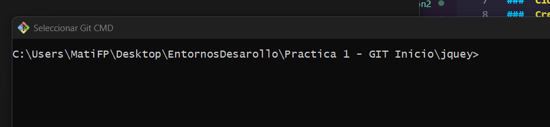

**2. Clonad el proyecto de la libreria Jquery que lo mantiene en github.**
* https://www.github.com/jquery/jquery.git

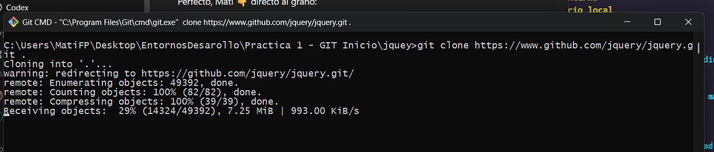

**3. Entrad en el directorio creado (jquery) y mostrad un log de los estados por los que ha pasado el proyecto.**

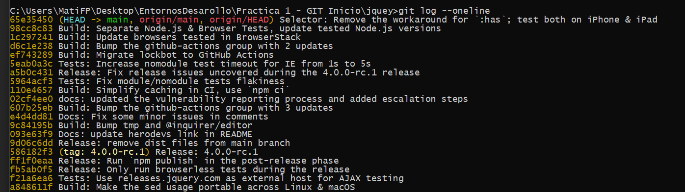
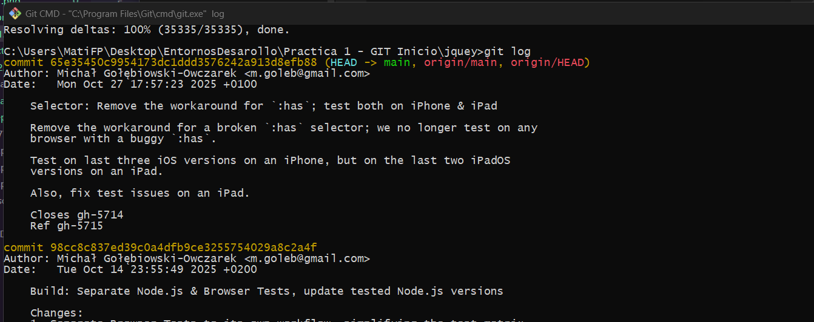

--- 

## 2.-Crear un repositorio local

**1. Cread un directorio donde vamos a empezar el proyecto y acceder a él.**

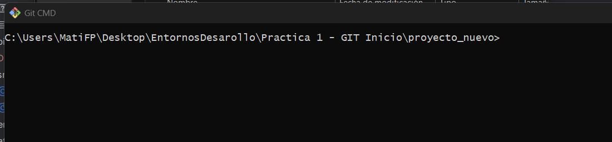

**2. Inicializad el repositorio**

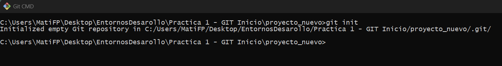

**3. Cread un primer archivo "archivo1.txt"**

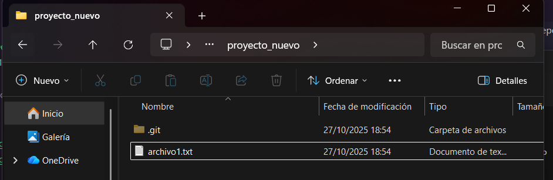

**4. Visualizad el estado del proyecto**

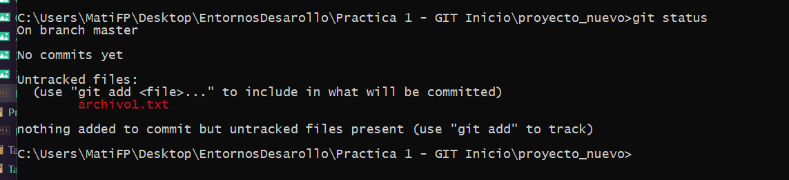

**5. Pasad el archivo del espacio de trabajo a la zona de preparación.**

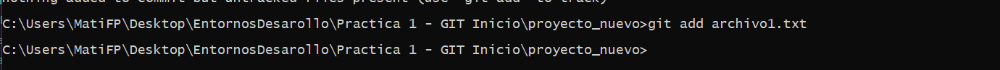

**6. Visualizad de nuevo el estado del proyecto**

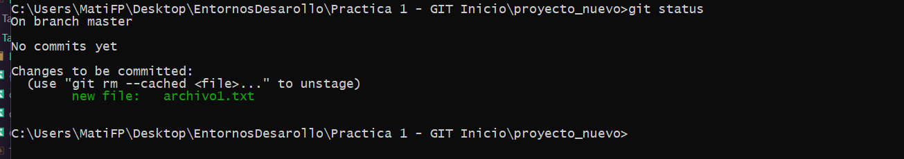

**7. Realizad el primer commit y visualizad de nuevo el estado del proyect**

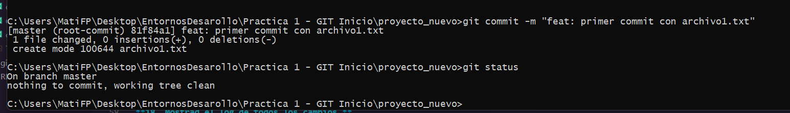

**8. Cread dos archivos más al proyecto. "archivo2.txt" y "archivo3.txt"**

**9. Pasad el segundo archivo a la zona de preparación.**

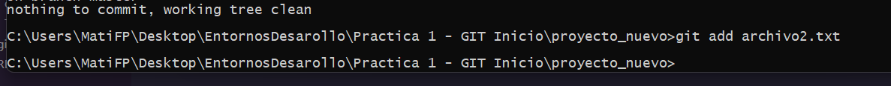

**10. Haced Segundo commit del proyecto.**

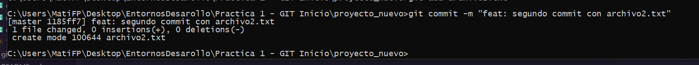

**11. Añadid el ultimo archivo a la zona de preparación y realizad el commit.**

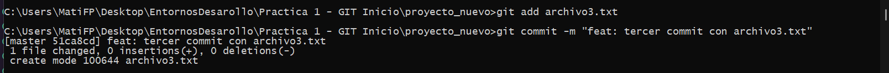

**12. Mostrad el log de todos los cambios.**

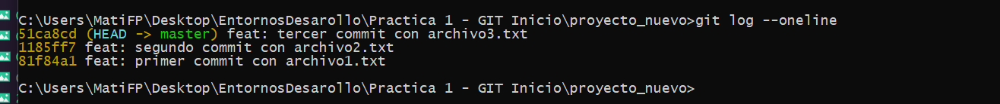

**13. Cambiad el archivo "archivo1.txt" y verificad el estado de git.**

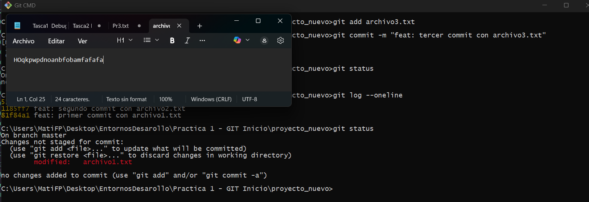

**14. Pasad el archivo a la zona de preparación.**

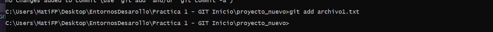

**15. Modificad los archivos 2 y 3 del proyecto. Verificad estado del git.**

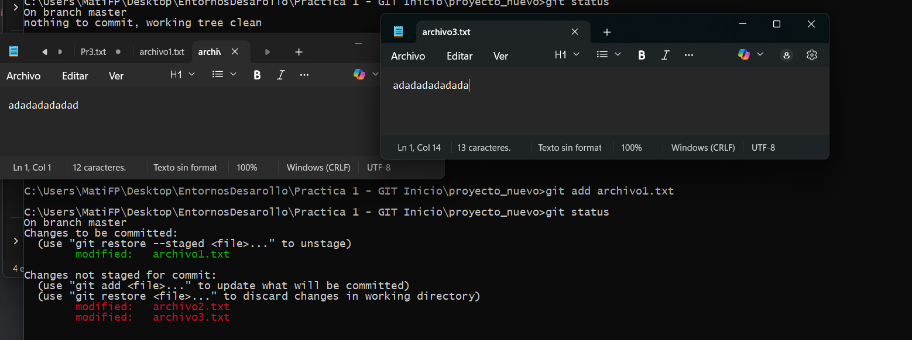

**16. Pasad los archivos 2 y 3 a la zona de preparación.**

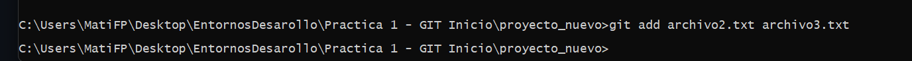

**17. Realizar el commit de los cambios realizados.**

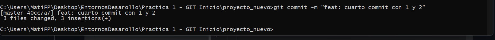

**18. Mostrad el log de todos los cambios.**

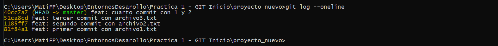

--- 
