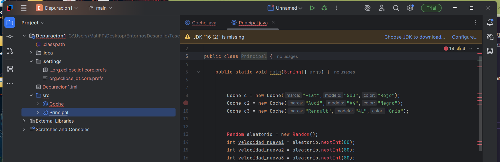
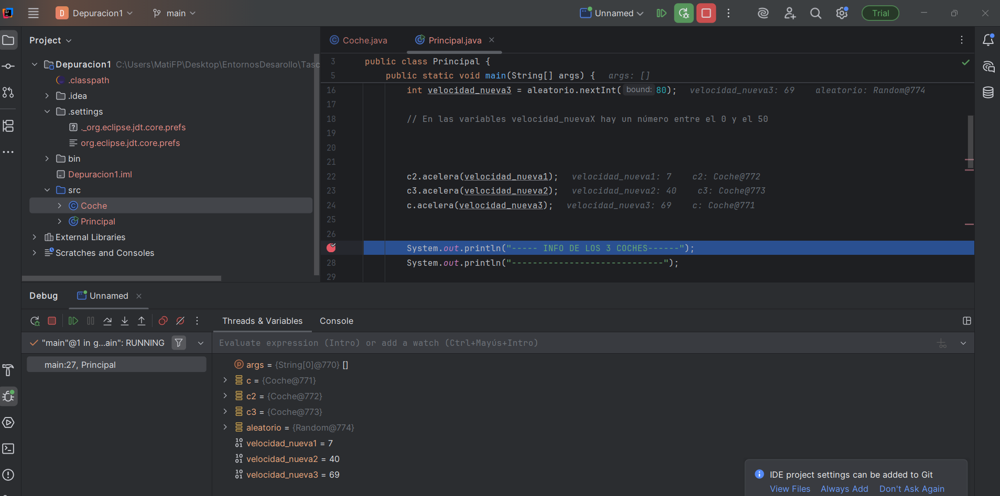
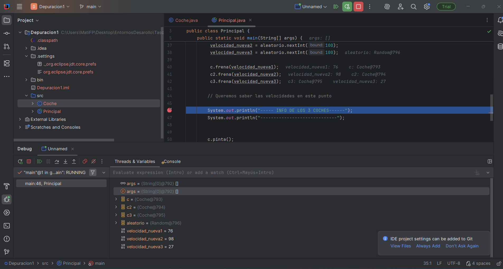

# U2: TASCA 2.
**Matias Bejar**

---

**Objectiu:**
Saber obtindre les dades d'un codi java mitjançant eina de depuració de codi.

**Enunciat:*
Donat el codi a JAVA de la classe cotxe que compta amb els mètodes:
    • constructor on se li estableix la marca, model, color i la velocitat inicial del qual és 0.
    • getters i setters de cada paràmetre.
    • Mètode accelera (int vel) que incrementa la velocitat del cotxe en “vel” Km/h.
    • Mètode frena(int vel) que decrementa la velocitat del cotxe en “vel” Km/h.
    • para() que posa la velocitat a 0.
    • pinta() que pinta el cotxe més a prop o més lluny segons la velocitat que tinga en aqueix moment.

A més , la classe Principal té el mètode:
pubic static void main(String [] args) punt d'inici del programa

---

*0.* Importar el projecte en INTELLIJ.

---

*1.* Explicad QUÈ FA EL MÈTODE MAIN.

El método main es el punto de inicio del programa.
En él se crean tres coches diferentes, guardados en las variables c, c2 y c3.

A cada coche se le asigna una velocidad aleatoria utilizando la clase Random, y luego el programa muestra por pantalla la información de los coches después de acelerar.

Más adelante, se vuelven a generar nuevos valores de velocidad para simular que los coches frenan, y nuevamente se muestran por pantalla los datos actualizados.

En resumen, el método main sirve para probar los métodos de la clase Coche (acelera, frena y pinta) y observar cómo cambian las velocidades de los coches.

---

*2.* Posad un punt de ruptura (breakpoint) en la línia 27 del mètode main de la classe Principal i esbrineu els valors de les variables velocitat_nueva1, velocitat_nueva2 i velocitat_nueva3. Esbrineu també quines dades tenen en els seus paràmetres els cotxes amb variables c,c2 i c3.

velocidad_nueva1 = 7
velocidad_nueva3 = 69
velocidad_nueva2 = 40
aleatorio = {Random@774} 
c3 = {Coche@773} 
c2 = {Coche@772} 
c = {Coche@771} 

---

*3.* Posad un punt de ruptura (breakpoint) en la línia 46 del mètode main de la classe Principal i esbrineu els valors de les variables velocitat_nueva1, velocitat_nueva2 i velocitat_nueva3. Esbrineu també quines dades tenen en els seus paràmetres els cotxes amb variables c,c2 i c3.

velocidad_nueva3 = 27
c = {Coche@793} 
c2 = {Coche@794} 
c3 = {Coche@795} 
aleatorio = {Random@796} 
velocidad_nueva1 = 76
velocidad_nueva2 = 98

---

*Nota:* Realitzeu les captures de pantalla que cregueu convenient per a adjuntar en el document.
(per exemple com pinta els cotxes el programa abans de frenar i després de frenar)
Contesteu les qüestions en un fitxer markdown i pugeu-lo al vostre repositori GITHUB. Dins d'una
carpeta anomenada Depuración2 Compartiu la URL del repositori.

*Nota:* El mètode nextInt(valor) de la clase Random obtí un número aleatori entre 0 i val
